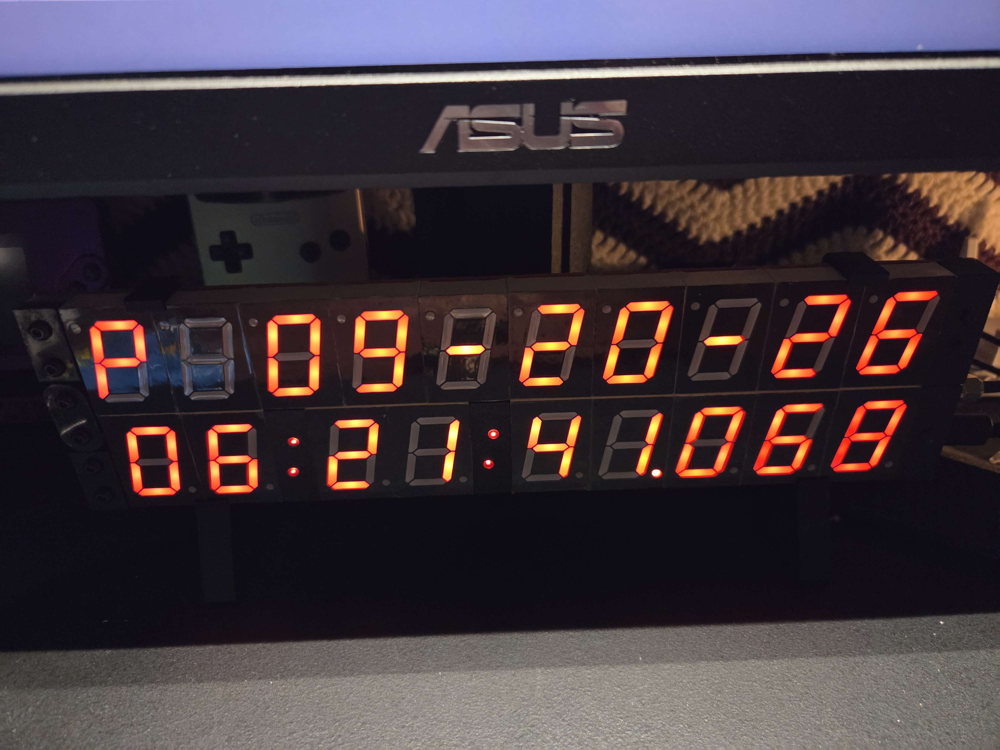

# Precision Clock Mk IV

Source code for the [Precision Clock Mk IV](https://mitxela.com/projects/precision_clock_mk_iv)

## This fork

12 hour time on the main display, with an am/pm marker and MM-DD-YY on the date display.

`HOUR_FORMAT` in `config.txt` takes 12 or 24, and defaults to 12 here. The leading zero is
kept, so 3:53am reads `03:53`, and midnight and noon both show `12`. The date mode is
`MODE_AMPM_MMDDYY`: an `A` or `P`, a blank digit, then MM-DD-YY. The marker is blank when
`HOUR_FORMAT` is 24. Only the two hour digits are converted - the date, the RTC and the
internal timekeeping all stay 24 hour, so nothing downstream changes meaning.

Only `mk4-time` is modified, so only `fwt.bin` needs reflashing. `qspi/fw-crc.ps1` is a
Windows equivalent of `fw-crc.sh`, for machines without the `crc32` perl script.

## Upstream

There are three software projects, compiled with STM32CubeIDE:

- mk4-time is the main clock source code running on the STM32L476
- mk4-date is the secondary display running on the STM32L010
- mk4-bootloader runs on the STM32L476 to do firmware updates

In the QSPI folder, there are scripts to create firmware images with CRC that the clock will recognise, along with the scripts to create the tzrules and create a valid disk image, see [these notes](qspi/qspi.md) for more info.

Timezone detection is ported from [ZoneDetect](https://github.com/BertoldVdb/ZoneDetect) by Bertold Van den Bergh and uses shapefile data from [Timezone Boundary Builder](https://github.com/evansiroky/timezone-boundary-builder) by Evan Siroky.
